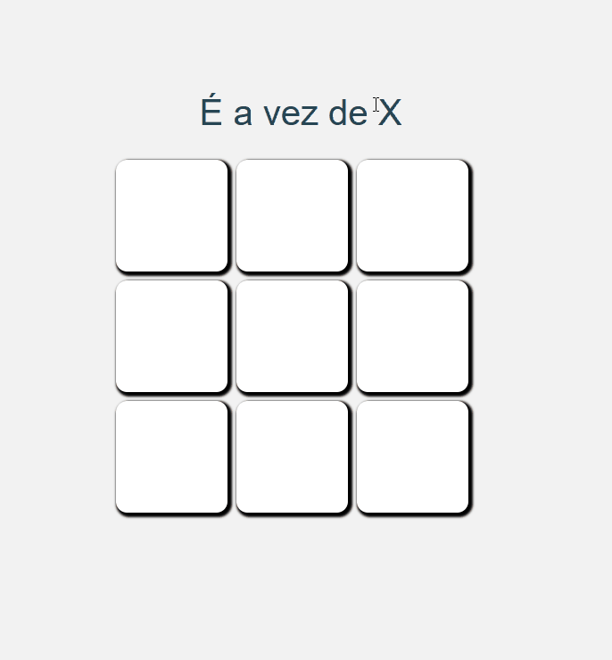

<html>

# Projeto Jogo da velha

- Essa aplicação, foi desenvolvida com intuito de treinar a logíca de programação.

# Ferramentas utilizadas

- React

- TypeScript

# Abaixo um GIF com a demostração

</html>